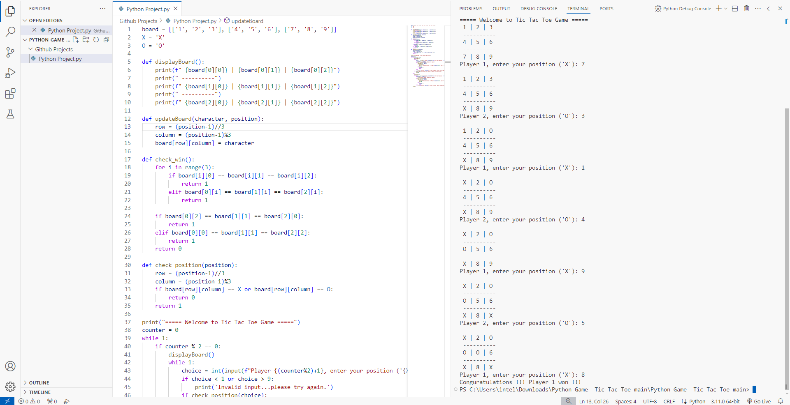

# Tic Tac Toe Game

This project is a simple command-line Tic Tac Toe game implemented in Python.

## Description

- A two-player game where players take turns to mark `X` or `O` on a 3x3 grid.
- The first player to get three of their marks in a row (horizontally, vertically, or diagonally) wins.
- If all 9 squares are filled without a winner, the game ends in a draw.

## Features

- Interactive command-line interface.
- Input validation to ensure valid moves.
- Automatic win and draw detection.

## How to Play

1. Clone the repository:
    ```bash
    git clone https://github.com/AdiMo04/tic-tac-toe.git
    cd tic-tac-toe
    ```

2. Run the game:
    ```bash
    python tic_tac_toe.py
    ```

3. Follow the on-screen instructions to play the game.

## Game Rules

- Players take turns to place their marks (`X` and `O`).
- Enter the number corresponding to the position on the board where you want to place your mark.
- The game checks for a winner or a draw after each move.

## Snippets:


